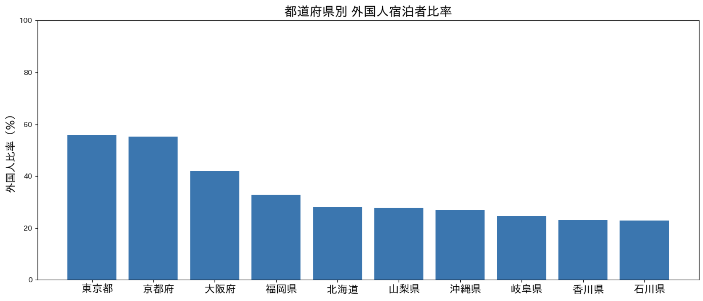

# Regional Concentration of Inbound Tourism in Japan

Data Source: Japan Tourism Agency（観光庁）Accommodation Travel Statistics（宿泊旅行統計調査）

2025年（令和7年）1月~12月分（年間の速報値) 集計結果：
https://www.mlit.go.jp/kankocho/tokei_hakusyo/shukuhakutokei.html

## Foreign Tourist Ratio by Prefecture (Top 10, 2025)

This figure shows the share of foreign tourists in total overnight stays by prefecture in 2025 (top 10).

Tokyo and Kyoto record the highest ratios at around 55%, followed by Osaka at over 40%. 
In contrast, most other prefectures fall within the 20–30% range.

This suggests that inbound tourism in Japan remains highly concentrated in major urban destinations, rather than being evenly distributed across regions.
